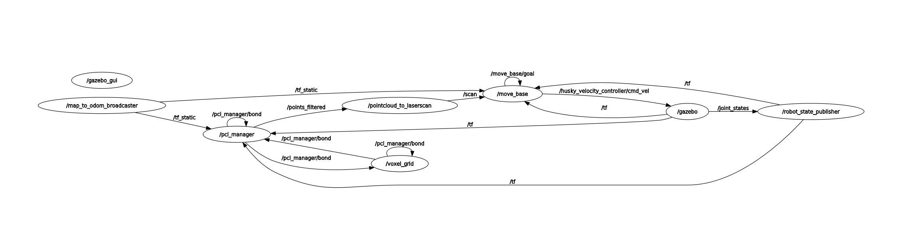
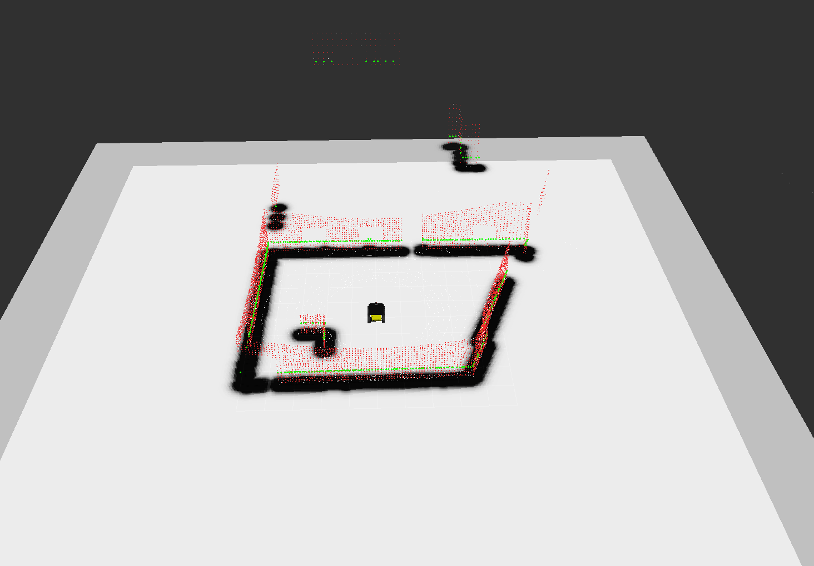

# DWA Navigation Package

Gazebo 시뮬레이션 환경에서 Husky 로봇과 Ouster LiDAR를 활용한 DWA(Dynamic Window Approach) 기반 장애물 회피 네비게이션 패키지입니다.

## 개요

본 패키지는 Gazebo 시뮬레이션 환경에서 Husky A200 로봇에 Ouster OS1-32 LiDAR를 장착하여 DWA Local Planner를 이용한 자율 주행 네비게이션을 구현합니다.

### 주요 특징

- **Gazebo 시뮬레이션**: 현실적인 물리 엔진 기반 로봇 시뮬레이션
- **DWA Local Planner**: 동적 장애물 회피 경로 계획
- **실시간 Costmap**: Laser scan 기반 장애물 맵 생성

## 주요 기능

### 1. 로봇 플랫폼
- **Husky A200**: Clearpath Robotics의 4륜 차동 구동 로봇
- **Skid Steer Drive**: 실제 하드웨어와 동일한 좌/우 2개 그룹 제어 방식
- **센서**: Ouster OS1-32 LiDAR, IMU, GPS

### 2. 센서 처리 파이프라인
```
Ouster PointCloud2 → VoxelGrid Filter → PointCloud to LaserScan → Move Base
```

### 3. 네비게이션 스택
- **Global Planner**: Global Planner (Dijkstra 기반)
- **Local Planner**: DWA Local Planner (동적 장애물 회피)
- **Costmap**: Rolling window 기반 local/global costmap

## 시스템 구조

### ROS 노드 그래프

<div align="center">
  
  <p><em>시스템 노드 연결 구조</em></p>
</div>

**주요 노드:**
- `gazebo`: Gazebo 물리 시뮬레이터
- `move_base`: 네비게이션 스택 코어
- `pointcloud_to_laserscan`: 3D → 2D 변환
- `robot_state_publisher`: TF 퍼블리셔
- `voxel_grid`: 포인트 클라우드 다운샘플링

### TF 트리
```
map → odom → base_link → sensors (lidar, imu, wheels)
```

## 설치 방법

### 1. 의존성 설치

```bash
sudo apt-get update
sudo apt-get install -y \
    ros-noetic-gazebo-ros \
    ros-noetic-gazebo-plugins \
    ros-noetic-move-base \
    ros-noetic-dwa-local-planner \
    ros-noetic-global-planner \
    ros-noetic-costmap-2d \
    ros-noetic-pointcloud-to-laserscan \
    ros-noetic-pcl-ros \
    ros-noetic-nodelet \
    ros-noetic-robot-state-publisher \
    ros-noetic-joint-state-publisher \
    ros-noetic-tf2-ros
```

### 2. 워크스페이스 설정

```bash
# 워크스페이스 생성
mkdir -p ~/catkin_ws/src
cd ~/catkin_ws

# 패키지 복사 (이미 존재하는 경우)
# 또는 git clone으로 가져오기

# 빌드
catkin_make

# 환경 설정
source devel/setup.bash
```

## 실행 방법

### Gazebo 시뮬레이션 + DWA 네비게이션

```bash
# Terminal 1: Gazebo 환경 및 로봇 스폰
roslaunch dwa gazebo_spawn.launch

# Terminal 2: DWA 네비게이션 실행
roslaunch dwa dwa_navigation.launch
```

### RViz에서 목표 설정

1. RViz 창에서 상단 메뉴의 **"2D Nav Goal"** 버튼 클릭
2. 목표 지점을 클릭하고 드래그하여 방향 설정
3. 로봇이 자동으로 경로를 계획하고 이동

### 주요 토픽

| 토픽 | 타입 | 설명 |
|------|------|------|
| `/ouster/points` | `sensor_msgs/PointCloud2` | Ouster LiDAR 원시 데이터 |
| `/scan` | `sensor_msgs/LaserScan` | 2D Laser scan 변환 데이터 |
| `/husky_velocity_controller/cmd_vel` | `geometry_msgs/Twist` | 로봇 속도 명령 |
| `/move_base/goal` | `move_base_msgs/MoveBaseActionGoal` | 네비게이션 목표 |
| `/move_base/global_costmap/costmap` | `nav_msgs/OccupancyGrid` | 전역 코스트맵 |

## 시연 영상

### RViz 시각화

<div align="center">
  
  <p><em>Ouster LiDAR 포인트 클라우드 및 네비게이션 시각화</em></p>
</div>

**화면 구성:**
- **빨간색/초록색 포인트**: Ouster LiDAR 포인트 클라우드
- **검은색 장애물**: Costmap 장애물 표현
- **노란색 로봇 모델**: Husky A200
- **회색 평면**: Gazebo 환경

### 실행 영상

<div align="center">
  
  <p><em>DWA 네비게이션 실행 데모</em></p>
</div>

## 설정 파일

### Launch 파일

- `gazebo_spawn.launch`: Gazebo 환경 및 로봇 스폰
- `dwa_navigation.launch`: DWA 네비게이션 + RViz 실행
- `husky_control_nav_localization.launch`: 실제 로봇용 통합 시스템 (Faster-LIO + GPS)

### Config 파일 (`config/`)

- `robot_dynamics_params.yaml`: 로봇 속도/가속도 제한
- `path_planning_params.yaml`: DWA 플래너 파라미터
- `costmap_common_params.yaml`: Costmap 공통 설정
- `local_costmap_params.yaml`: Local costmap 설정
- `global_costmap_params.yaml`: Global costmap 설정

## 기술 상세

### 1. 커스텀 Husky URDF 구성

#### 1.1 Skid Steer Drive 제어 방식 변경

기존 Husky는 `gazebo_ros_control` + PID 방식을 사용했으나, 실제 로봇 하드웨어와 일치시키기 위해 **Skid Steer Drive Plugin**으로 변경:

**변경 이유:**
- 실제 Husky 하드웨어([husky_hardware.cpp](../husky_robot/husky_base/src/husky_hardware.cpp#L196-L204))는 4개 바퀴를 LEFT/RIGHT 2개 그룹으로 제어
- Gazebo PID는 각 바퀴를 개별 제어하므로 실제 하드웨어와 동작 방식이 다름

**수정 내용:**

1. **[husky.urdf.xacro](../husky/husky_description/urdf/husky.urdf.xacro#L373-L410)**: Skid Steer Drive Plugin 추가
   ```xml
   <plugin name="skid_steer_drive_controller" filename="libgazebo_ros_skid_steer_drive.so">
     <leftFrontJoint>front_left_wheel</leftFrontJoint>
     <leftRearJoint>rear_left_wheel</leftRearJoint>
     <rightFrontJoint>front_right_wheel</rightFrontJoint>
     <rightRearJoint>rear_right_wheel</rightRearJoint>
     <wheelSeparation>0.5708</wheelSeparation>
     <wheelDiameter>0.3302</wheelDiameter>
     <broadcastTF>true</broadcastTF>  <!-- odom → base_link TF 발행 -->
   </plugin>
   ```

2. **[wheel.urdf.xacro](../husky/husky_description/urdf/wheel.urdf.xacro#L64-L74)**: Transmission 주석 처리
   - PID 제어와 Skid Steer 제어의 충돌 방지
   - 각 바퀴의 `<transmission>` 태그 비활성화

3. **[husky.urdf.xacro](../husky/husky_description/urdf/husky.urdf.xacro#L412-L420)**: Joint State Publisher 추가
   ```xml
   <plugin name="joint_state_publisher" filename="libgazebo_ros_joint_state_publisher.so">
     <jointName>front_left_wheel, front_right_wheel, rear_left_wheel, rear_right_wheel</jointName>
   </plugin>
   ```
   - 바퀴 조인트의 TF 발행 (RViz 시각화용)

#### 1.2 Ouster OS1-32 LiDAR 통합

**파일 구조:**
- [custom_description_ouster_gps.urdf.xacro](urdf/custom_description_ouster_gps.urdf.xacro): Husky에 Ouster + GPS 장착
- [OS1-32.urdf.xacro](urdf/OS1-32.urdf.xacro): Ouster 센서 정의

**Gepetto 플러그인 사용 ([GitHub](https://github.com/Gepetto/ouster-gazebo-simulation)):**

1. **소스 파일 다운로드:**
   - [GazeboRosOusterLaser.cpp](plugins/src/GazeboRosOusterLaser.cpp)
   - [GazeboRosOusterLaser.h](plugins/include/ouster_gazebo_plugins/GazeboRosOusterLaser.h)

2. **CMakeLists.txt 수정 ([CMakeLists.txt](CMakeLists.txt)):**
   ```cmake
   # GPU 버전 빌드
   add_library(gazebo_ros_ouster_gpu_laser plugins/src/GazeboRosOusterLaser.cpp)
   target_compile_definitions(gazebo_ros_ouster_gpu_laser PRIVATE GAZEBO_GPU_RAY=1)
   target_link_libraries(gazebo_ros_ouster_gpu_laser GpuRayPlugin)

   # CPU 버전 빌드
   add_library(gazebo_ros_ouster_laser plugins/src/GazeboRosOusterLaser.cpp)
   target_compile_definitions(gazebo_ros_ouster_laser PRIVATE GAZEBO_GPU_RAY=0)
   ```

3. **OS1-32.urdf.xacro 수정:**
   ```xml
   <xacro:arg name="gpu" default="true"/>
   <xacro:if value="${gpu}">
     <sensor type="gpu_ray" name="${name}-OS1-32">
       <plugin name="gazebo_ros_laser_controller" filename="libgazebo_ros_ouster_gpu_laser.so">
   ```

**센서 사양:**
- 32채널 수직 해상도
- 수평 해상도: 512, 1024, 2048 선택 가능
- 거리: 0.3m ~ 75m
- 주파수: 10Hz

### 2. 포인트 클라우드 처리 파이프라인

```
Ouster Raw PointCloud2 (32×512 points)
  ↓
VoxelGrid Filter (0.1m leaf size) - 다운샘플링
  ↓
PointCloud to LaserScan - 2D 변환
  ↓
Move Base Costmap - 장애물 인식
```

### 3. 네비게이션 토픽 리매핑

**문제:** Move Base와 Skid Steer Plugin의 cmd_vel 토픽 불일치
- Move Base 발행: `/cmd_vel`
- Skid Steer 구독: `/husky_velocity_controller/cmd_vel`

**해결:** [dwa_navigation.launch](launch/dwa_navigation.launch)에서 리매핑
```xml
<node pkg="move_base" type="move_base" name="move_base">
  <remap from="cmd_vel" to="husky_velocity_controller/cmd_vel"/>
</node>
```


## 참고 자료

- [Clearpath Husky Documentation](https://clearpathrobotics.com/husky-unmanned-ground-vehicle-robot/)
- [DWA Local Planner](http://wiki.ros.org/dwa_local_planner)
- [Ouster Gazebo Simulation](https://github.com/Gepetto/ouster-gazebo-simulation)
