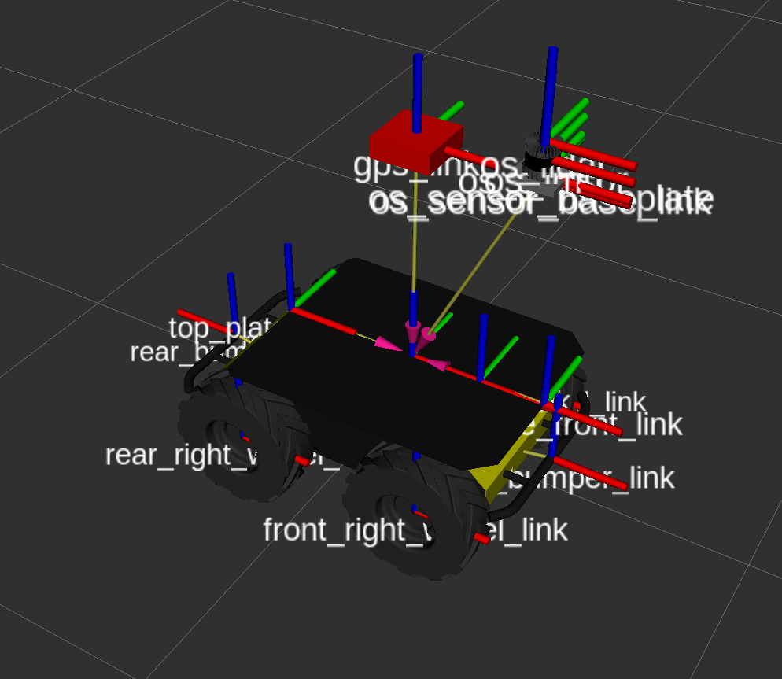

# robot_description

`robot_description` 패키지는 Ouster LiDAR와 GPS 센서가 장착된 커스텀 Husky 로봇의 URDF(Unified Robot Description Format) 모델을 정의합니다.

이 패키지는 단순히 로봇의 외형과 관절을 정의하는 것을 넘어, Gazebo 시뮬레이션을 위한 커스텀 플러그인을 포함하여 실제 로봇과 매우 유사한 동작을 구현합니다.

## 1. 로봇 모델 시각화 (RViz)

다음은 `display.launch` 파일을 통해 RViz에서 시각화한 로봇의 모습입니다.



## 2. 주요 특징

- **상세 로봇 모델**: Clearpath Husky를 기반으로 Ouster OS1-32 LiDAR와 GPS 모듈을 상단에 장착한 모델입니다.
- **커스텀 Gazebo 플러그인**:
  - **Husky Differential Drive**: `ros_control`을 사용하지 않고, 실제 하드웨어처럼 `cmd_vel` 명령을 직접 바퀴 속도로 변환하여 구동하는 플러그인입니다.
  - **Ouster LiDAR**: Gazebo의 Ray Sensor 데이터를 `ring`, `intensity` 정보가 포함된 `sensor_msgs/PointCloud2` 메시지로 변환하여 실제 Ouster LiDAR와 유사한 데이터를 생성합니다.
- **URDF 기반 TF 발행**: `robot_state_publisher`를 통해 로봇의 모든 정적(static) Transform 관계(`base_link` → 센서, 바퀴 등)를 자동으로 발행합니다.

## 3. 패키지 구조

```
robot_description/
├── urdf/                     # 로봇 모델의 핵심 정의 파일 (XACRO)
│   ├── custom_description.urdf.xacro  # 메인 URDF 파일
│   ├── OS1-32.urdf.xacro       # Ouster LiDAR 센서 정의
│   └── gps.urdf.xacro          # GPS 센서 정의
├── plugins/                    # 커스텀 Gazebo 플러그인 소스 코드
│   ├── include/
│   └── src/
│       ├── husky_gazebo_plugin.cpp      # 차동 구동 플러그인
│       └── GazeboRosOusterLaser.cpp   # Ouster LiDAR 플러그인
├── launch/                     # 실행을 위한 launch 파일
│   ├── robot_description.launch # URDF 로드 및 state publisher 실행
│   └── display.launch           # RViz 시각화 실행
├── meshes/                     # 로봇 모델에 사용되는 3D 메시 파일 (e.g., os1_64.dae)
├── rviz/                       # RViz 설정 파일
│   └── robot.rviz
└── docs/                       # README에 사용되는 이미지
    └── image/
```

## 4. URDF 구조 (`custom_description.urdf.xacro`)

이 파일은 전체 로봇 모델을 조합하는 최상위 파일입니다.

1.  **Husky 베이스**: `husky_description` 패키지의 기본 `husky.urdf.xacro`를 포함합니다.
2.  **Ouster LiDAR**: `OS1-32.urdf.xacro`를 포함하여 `top_plate_link` 위에 LiDAR를 추가합니다. (`origin: 0.3 0.0 0.6`)
3.  **GPS**: `gps.urdf.xacro`를 포함하여 `top_plate_link` 위에 GPS를 추가합니다. (`origin: 0.0 0.0 0.6`)
4.  **커스텀 구동 플러그인**: Gazebo 시뮬레이션 시, `libhusky_gazebo_plugin.so`를 사용하도록 설정하여 차동 구동을 제어합니다.

## 5. TF 트리

`robot_state_publisher`에 의해 발행되는 TF 트리 구조입니다. `map` → `odom` → `base_link` 변환은 외부 노드(예: `robot_localization`, `faster-lio`)에 의해 발행되며, 이 패키지는 `base_link` 이하의 모든 정적 관계를 담당합니다.


- **`base_link`**
  - `top_plate_link`
    - `os_sensor_base_link` → `os_sensor`
      - `os_imu` (LiDAR 내부 IMU)
      - `os_lidar` (LiDAR 포인트 클라우드)
    - `gps_link` (GPS 센서)
  - `front_left_wheel`, `front_right_wheel`, ... (바퀴 링크)
  - `inertial_link` (Husky 내부 IMU)

## 6. 사용 방법

### 로봇 모델 로드

URDF를 파라미터 서버에 로드하고, `robot_state_publisher`와 `joint_state_publisher`를 실행합니다.

```bash
roslaunch robot_description robot_description.launch
```

### RViz에서 시각화

로봇 모델을 RViz에서 확인합니다. (Gazebo 시뮬레이션 없이 모델만 확인)

```bash
roslaunch robot_description display.launch
```

## 7. 커스텀 Gazebo 플러그인 상세

### `libhusky_gazebo_plugin.so`

- **목적**: `ros_control`의 복잡한 설정 없이, 실제 Husky 하드웨어와 유사하게 `cmd_vel`을 직접 바퀴의 각속도로 변환하여 제어합니다.
- **구독**: `husky_velocity_controller/cmd_vel` (`geometry_msgs/Twist`)
- **발행**: `husky_velocity_controller/odom` (`nav_msgs/Odometry`) - 바퀴 엔코더 피드백 기반의 Odometry

### `libgazebo_ros_ouster_laser.so`

- **목적**: Gazebo의 기본 `RaySensor`가 생성하는 데이터를 실제 Ouster LiDAR와 유사한 `sensor_msgs/PointCloud2` 메시지로 가공합니다.
- **특징**: 포인트 클라우드의 각 포인트에 `x, y, z` 외에도 `intensity`(반사 강도)와 `ring`(레이저 채널 번호) 필드를 추가하여 발행합니다.
- **발행**: `/ouster/points` (`sensor_msgs/PointCloud2`)